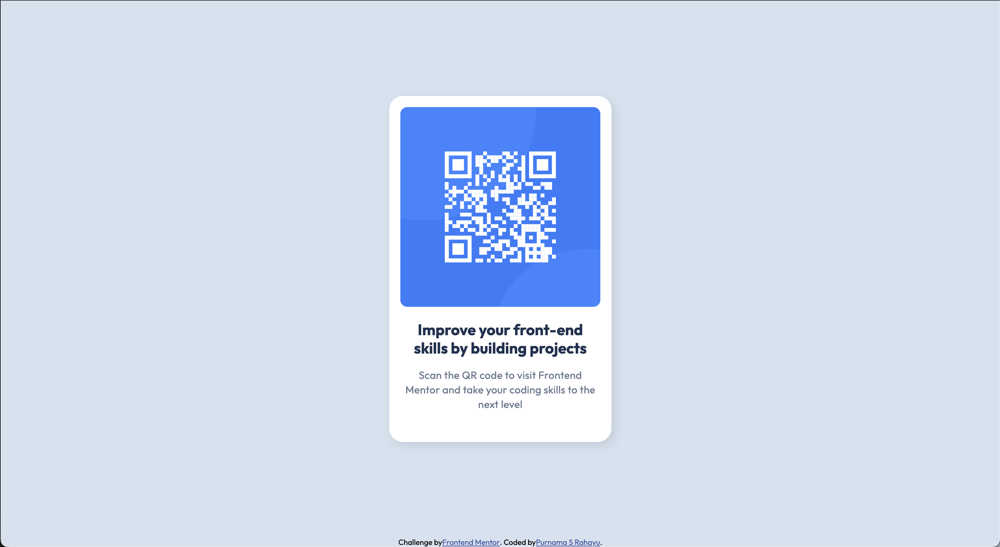

# Frontend Mentor - QR code component solution

This is a solution to the [QR code component challenge on Frontend Mentor](https://www.frontendmentor.io/challenges/qr-code-component-iux_sIO_H). Frontend Mentor challenges help you improve your coding skills by building realistic projects. 

## Table of contents

- [Overview](#overview)
  - [Screenshot](#screenshot)
  - [Links](#links)
- [My process](#my-process)
  - [Built with](#built-with)
  - [What I learned](#what-i-learned)
  - [Useful resources](#useful-resources)
- [Author](#author)

**Note: Delete this note and update the table of contents based on what sections you keep.**

## Overview

### Screenshot




### Links

- Solution URL: [Add solution URL here](https://your-solution-url.com)
- Live Site URL: [Add live site URL here](https://your-live-site-url.com)

## My process

### Built with

- Semantic HTML5 markup
- CSS custom properties
- Flexbox

### What I Learned

I learned to implement a design into a simple web page. First, I created a `div` element with a white background to contain the QR image and text, and added an `img` tag specifying its width and height.

I struggled to position the elements correctly and had to search online, mainly about centering elements. I find centering elements (div, img, text) challenging and often need to look up how to do it.

Here's how I centered the elements:

```html
<body>
    <div class="card">
        <!-- QR image and texts go here -->
    </div>
    <div class="attribution">
        some text
    </div>
</body>
```

```css
html, body {
  margin: 0;
  height: 100%;
}
```
Setting `margin: 0;` removes default browser margins. `height: 100%;` ensures the body takes up the full screen height, placing the second `div` at the bottom.

```css
body {
  display: flex;
  flex-direction: column;
  align-items: center;
}
```
`display: flex;` with `flex-direction: column;` centers the `div` elements vertically. `align-items: center;` centers them horizontally within the column-based flex container.

For the QR image and text, I grouped them in a `div` with class `card`.
`margin: auto;` centers the card within the flex container.

### Useful resources

- [W3 Schools](https://www.w3schools.com) - This helped me to understand flex and how to center a div.

## Author

- Website - [Add your name here](https://purnamaa.dev)
- Frontend Mentor - [@catreedle](https://www.frontendmentor.io/profile/catreedle)